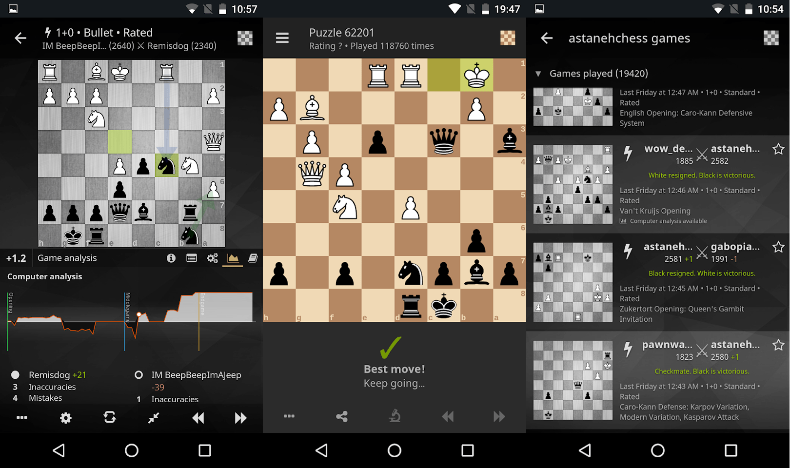

> [!WARNING]
> ## Deprecation notice
>
> This repository is deprecated. Maintainers may respond only to reports of critical bugs and security issues.
> The application is being rewritten from the ground up in Flutter [here](https://github.com/lichess-org/mobile).
> Until it is published, if you run into issues with this app, we suggest you use the mobile website.

[lichess.org/mobile](http://lichess.org/mobile)
--------------------

Lichess mobile is the lichess.org official application. It is written
in [TypeScript](http://www.typescriptlang.org/), with a bit of Kotlin and Swift.
It is a web application that accesses the native SDK, thanks to [Ionic capacitor](https://capacitor.ionicframework.com/).
The rendering library is [mithril.js](http://mithril.js.org/).
It talks to a native [Stockfish](https://stockfishchess.org/) engine, [supporting multiple variants](https://github.com/ddugovic/Stockfish), through a
[capacitor plugin](https://github.com/veloce/capacitor-stockfish).
Multi-variant chess library is brought by [a JavaScript version of scalachess](https://github.com/veloce/scalachessjs).

## Download

or get the APK from the [Releases section](https://github.com/lichess-org/lichobile/releases/latest)

## Required dependencies

* [node](http://nodejs.org) latest LTS version
* [ionic capacitor dependencies](https://capacitorjs.com/docs/getting-started/environment-setup)

**Android:**

* in addition to capacitor dependencies, [android ndk](http://developer.android.com/tools/sdk/ndk/index.html) for stockfish compilation (to install with Android Studio).

## Setup project

Make sure to install all dependencies:

    $ npm install

Capacitor needs the web app before sync, so build it:

    $ npm run build

Sync capacitor:

    $ npx cap sync

## Running in the browser

    $ npm run serve

Will serve assets at `http://localhost:8080`.
Once the server is up, browse to [http://localhost:8080/www](http://localhost:8080/www).

You should use a chromium based browser to be close to the android webview which
is based on chrome.

Be sure to [Toggle Device Mode](https://developers.google.com/web/tools/chrome-devtools/device-mode/)
or else you won't be able to click on anything.

## Running in a device/emulator

Be sure to install all the dependencies and follow the steps above in the [Setup
project section](#setup-project).

In order to build Stockfish, you need to download the current stockfish plugin
NNUE file and save it to the proper location for each platform:

    $ npm run fetch-nnue

### Android

Using command line:

    $ npx cap run android

Using android studio:

    $ npx cap open android

More information available [here](https://capacitorjs.com/docs/android).

#### Free version

By default, the output APK will rely on [Firebase Cloud
Messaging](https://firebase.google.com/docs/cloud-messaging) to support push
notifications. However, it is possible to remove this dependency if you don't
care about push notifications.

To build the free version:

    $ npm run patch-nonfree
    $ npx cap update android
    $ cd ./android
    $ ./gradlew assembleDebug

### iOS

You will need a `GoogleService-Info.plist` file in order to compile iOS project.
You can download a dummy one from the [firebase open-source project](https://raw.githubusercontent.com/firebase/firebase-ios-sdk/master/Firestore/Example/App/GoogleService-Info.plist).
Put it in the `ios/App/App/` folder.
Only debug builds are allowed with that example file. Push notifications
won't work, but you will be able to run the app on a simulator just fine.

Using command line:

    $ npx cap run ios

Using Xcode:

    $ npx cap open ios

More information available [here](https://capacitorjs.com/docs/ios).

## Advanced setup

See the [wiki](https://github.com/veloce/lichobile/wiki/Setting-up-the-app-using-a-local-setup-of-lichess).
