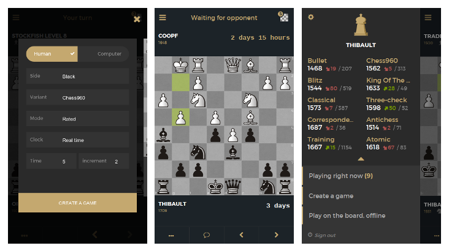

lichess mobile
==============



### Official lichess.org mobile application for Android & iOS.

- Play bullet, blitz, classical, and correspondence chess
- Play in arena tournaments
- Find, follow, challenge players
- See your games stats
- Practice with chess puzzles
- Many variants, available online and offline: Crazyhouse, Chess 960, King Of The Hill, Three-check, Antichess, Atomic chess, Horde, Racing Kings!
- Game analysis with local computer evaluation
- Play against offline computer
- Over The Board mode to play offline with a friend
- Standalone chess clock with multiple time settings
- Board editor
- Available in 80 languages
- Designed for both phones and tablets, supporting landscape mode
- 100% free, without ads, and opensource!

Get it now from [lichess.org/mobile](http://lichess.org/mobile)

Lichess mobile is written in JavaScript (ES6), with the help of [cordova](https://cordova.apache.org/)
and [mithril.js](http://mithril.js.org/). It uses [babel](http://babeljs.io/),
[browserify](http://browserify.org/), [gulp](http://gulpjs.com/) and [tarifa](http://tarifa.tools/)
as build tools. It talks to a native [Stockfish](https://stockfishchess.org/) interface through a
[cordova plugin](https://github.com/veloce/cordova-plugin-stockfish) and uses
an [async chess worker](https://github.com/veloce/scalachessjs) which is based
on [lichess scalachess module](https://github.com/ornicar/scalachess) compiled
to JavaScript.

## Requirements

* [node](http://nodejs.org) v5.x
* [gulp](http://gulpjs.com/) version 3.9.x
* [tarifa](http://tarifa.tools) latest version

**Android:**

* the [android SDK](http://developer.android.com/sdk/index.html)
* [SDK packages](http://developer.android.com/sdk/installing/adding-packages.html) API 23
* last version of Android SDK tools and platform tools
* [android ndk](http://developer.android.com/tools/sdk/ndk/index.html) for
  stockfish compilation
* make sure the `sdk/tools/` directory is in your path, so you can use `android`
  command everywhere.

**iOS:**

* OS X and [Xcode](https://developer.apple.com/xcode/download/) version 7.x

## Init project after checkout

    $ tarifa check --force

This will recreate the cordova folder with android and iOS platforms and also
install plugins.

## Build the web application

Make sure you installed all deps:

    $ cd project
    $ npm install

Then copy `project/env.json.example` to `project/env.json` and modify settings
to link your app to a lichess server.

To build in dev mode:

    $ gulp

To build and watch for changes:

    $ gulp watch

To run in a browser it needs to have
web security disabled for loading files and make requests to lichess.
For mouse interaction you need to use
[device mode](https://developers.google.com/web/tools/chrome-devtools/iterate/device-mode/)

Launch chrome with disabled security under linux

    $ chromium --user-data-dir=$HOME/.chromium_dev_dir --disable-web-security

Launch chrome with disabled security under OSX

    $ open -n -a Google\ Chrome --args --disable-web-security --user-data-dir=/Users/myUser/.chrome_dev_dir


## Build stockfish

### Android

Build the native code using:
```
ndk-build -C app/platforms/android
```

### iOS

Through XCode, in the build settings menu:
  * Set `C++ Language Dialect` option to `C++11` value.
  * Set `C++ Standard Library` option to `lib++` value.

## Build and run on your device

Connect your device with USB debugging enabled and:

    $ tarifa run [platform]

This will use the default configuration which use a development lichess server
end point.

Please look at [tarifa documentation](http://42loops.gitbooks.io/tarifa/content/)
for further documentation.
